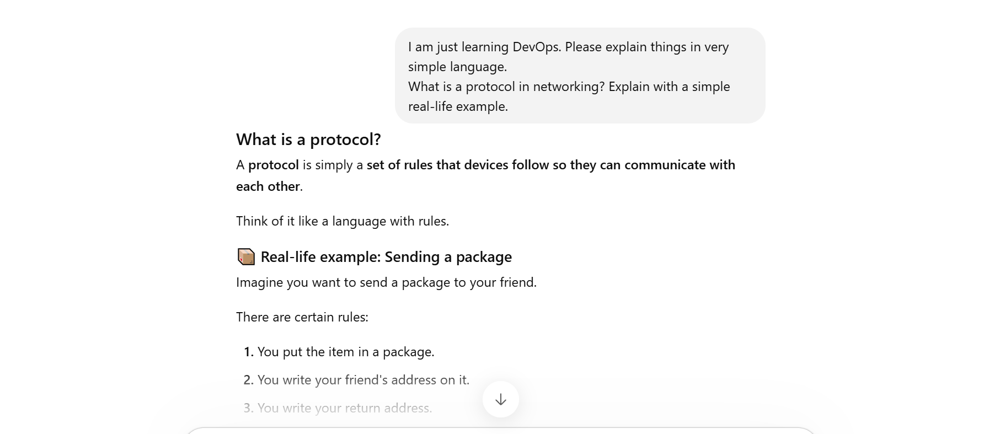
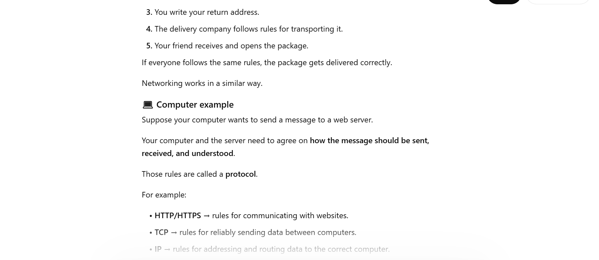
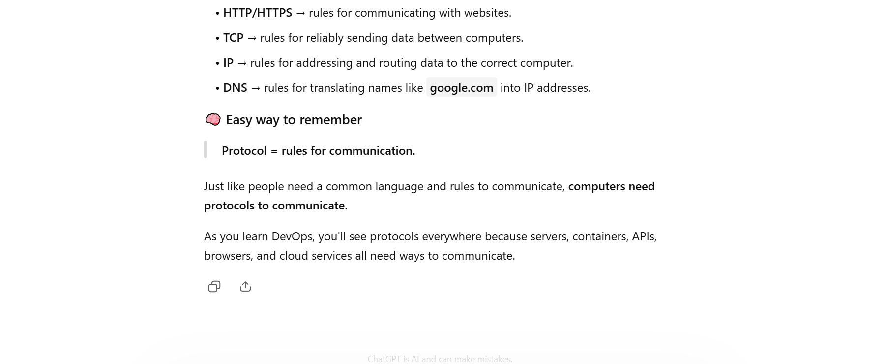
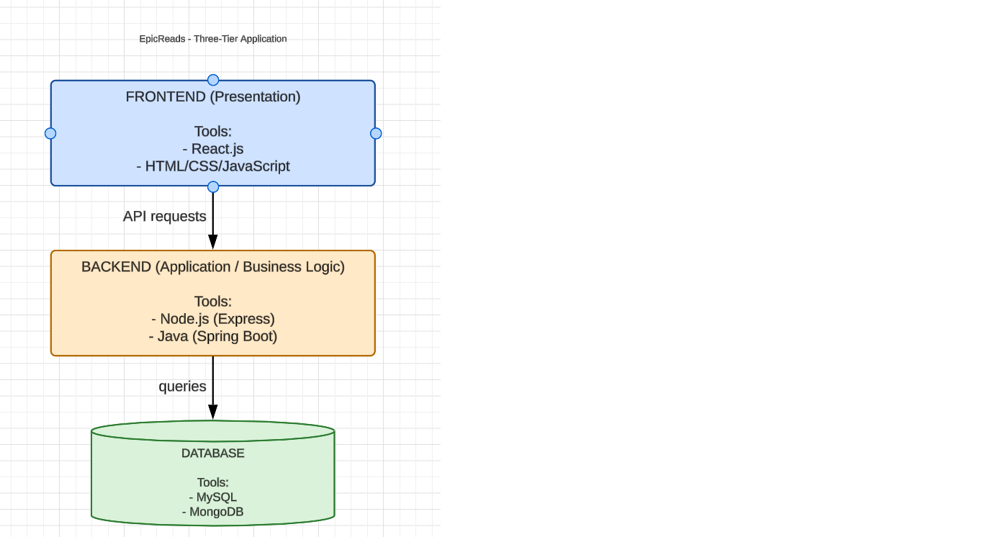
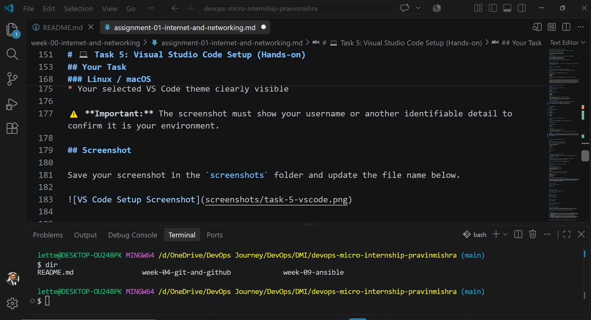

# Week 00 - Internet and Networking

Part of the DevOps Micro Internship (DMI) Cohort 3 with Agentic AI

---

# 🧑‍💻 Task 1: Using ChatGPT as Your Learning Assistant

## Scenario

You're new to DevOps and will frequently encounter technical questions. ChatGPT can be your learning companion.

## Your Task

Write a clear ChatGPT prompt to help you understand:

> "What is a protocol in networking? Explain with a simple real-life example."

Take a screenshot of your interaction showing:

* Your detailed prompt (with clear expectations)
* ChatGPT's simplified response with an example

## Screenshot

Save your screenshot in the `screenshots` folder and update the file name below.





Replace `task-1-chatgpt.png` with your actual screenshot file name.

---

## What I Learned (2–3 lines)

I learnt the port numbers specific for each protocol. Port 80 HTTP, Port 443 for HTTPS and Port 22 for SSH conncetion.

---

# 🌐 Task 2: Internet and Networking

## Scenario

Your friend is launching an online bookstore named **EpicReads**.

He asked you to explain how users globally can access his website hosted in Finland.

## Your Task

Write a short explanation (**100–150 words**) that includes:

* Packet Switching
* IP Address
* TCP/IP
* HTTP/HTTPS

💡 **Tip:** You may use ChatGPT (as demonstrated in Task 1) to refine your explanation.

## Answer

First, to access the website hosted in Finland, the computer needs communicate with the server in Finland, but this would not happen like magic. When a user type the name of the web site. The internet does not know the name by default, the name of the website has to be resolved to a unique number called the IP address, which is like the address of the server where the website is hosted. Your computer contacts several servers on the internet to ask them do you know whose IP addressthe name bears. When that is solved, then the user is handed the web page.

---

# 🏗️ Task 3: Application Architecture & Stack

## Scenario

EpicReads bookstore has two application versions:

### Two-Tier Application

* Frontend
* Database

### Three-Tier Application

* Frontend
* Backend
* Database

## Your Task

* Draw simple diagrams (hand-drawn or tool-based such as draw.io)
* Label each layer clearly
* List at least two common technologies or tools used for each layer
* Submit a screenshot or photo clearly showing your own drawing

## Diagram Screenshot / Photo

Save your diagram image in the `screenshots` folder and update the file name below.





---

## Technologies Used

### Frontend

* React.js
* HTML, CSS and Javascript

### Backend

* Node.js
* Express.js, bcrypt

### Database

* MySQL
* MongoDB

---

# 🌍 Task 4: Domain Name & DNS (Basic Concepts)

## Scenario

Your friend's bookstore **EpicReads** is currently accessible through:

```text
52.172.142.222:3000
```

He purchased the domain:

```text
epicreads.com
```

## Your Task

In **50–100 words**, explain in your own words:

1. What is DNS (Domain Name System)?
2. Which DNS record type should be used to connect the domain to the given IP, and why?

## Answer

Domain Name System is like phone book of the internet. It converts human-readable name such as "epicreads.com", into IP address, such as 52.172.142.222. Your browser connects to the server at that IP address and then display the website. The type of record to use is A record, because A record is for IPv4.


---

# 💻 Task 5: Visual Studio Code Setup (Hands-on)

## Your Task

Install Visual Studio Code (if not already installed).

Take a screenshot of your VS Code environment showing:

* Terminal open inside VS Code
* Running a basic command:

### Windows

```powershell
dir
```

### Linux / macOS

```bash
pwd
ls
```

* Your selected VS Code theme clearly visible

⚠️ **Important:** The screenshot must show your username or another identifiable detail to confirm it is your environment.

## Screenshot

Save your screenshot in the `screenshots` folder and update the file name below.




---

# 🔗 Task 6: Publish Your Assignment as a LinkedIn Post

## Objective

Publishing on LinkedIn helps you:

* Build your professional online presence
* Reinforce your learning
* Document your DevOps journey publicly

## Your Task

Summarize your answers from Tasks 1–5 into a LinkedIn post.

Clearly structure your post into the following sections:

* ChatGPT
* Internet & Networking
* App Architecture
* DNS
* VS Code Setup

Add the following credit note at the end of your post:

> **P.S. This post is part of the DevOps Micro Internship (DMI) with Agentic AI — Cohort 3 — by Pravin Mishra. My graded progress is public: https://dmi.pravinmishra.com/s/YOUR-GITHUB-USERNAME.html · Start your DevOps journey: https://dmi.pravinmishra.com/?utm_source=student&utm_medium=ps-linkedin&utm_campaign=cohort3**

---

## LinkedIn Post URL

Paste your LinkedIn post URL here:

```text
https://lnkd.in/p/e4p-NY-B
```

---

## LinkedIn Post Backup Copy

Connecting the Dots: Networking, Applications & DevOps
This is how I would explain some of these concepts to someone who is just starting to learn DevOps.
I’ve been spending time connecting some of the networking concepts that sit underneath the tools and technologies we use every day.
One concept I’ve been revisiting is networking protocols — the rules that allow devices and applications to communicate. I also reinforced some important port numbers: HTTP – 80, HTTPS – 443, and SSH – 22.
From there, I connected this to how the Internet works. Data is broken into packets and transmitted using packet switching. Devices communicate using IP addresses, while TCP/IP provides the foundation for communication. Protocols such as HTTP and HTTPS then enable communication between clients and web servers.
I also explored two-tier and three-tier application architectures, looking at how technologies can be separated across the presentation, application/business logic, and database layers. This helps us better understand how applications are designed and how the different components communicate with each other.
Another important piece is DNS (Domain Name System). Understanding how a domain name is translated into an IP address makes the process of accessing a website much clearer. I also learnt that an A record is used to map a domain name to an IPv4 address.
Having a good Visual Studio Code setup is also important before diving deeper into DevOps. A well-configured development environment makes it easier to practise, experiment, and work with the different tools involved.
One thing I’ve found particularly useful is using ChatGPT as a learning companion. When a concept isn’t immediately clear, I encourage students and fellow learners to ask for a simpler explanation, a real-world analogy, or a step-by-step breakdown. The goal isn’t to replace learning, but to ask the right questions to understand concepts more deeply and connect them to practical scenarios.
The more I connect these concepts, the more I see that DevOps is not just about knowing tools and commands. Understanding what happens underneath those tools is what makes the bigger picture come together.
Still learning. Still practising. Still connecting the dots — and ready to share what I learn along the way. 🚀
#DevOps #Networking #CloudComputing #Linux #LearningInPublic #TechJourney


---

# Reflection – Week 0

### What did you find easy?

The use of Chatgpt

---

### What was difficult?

Using Markdown on Github

---

### What will you improve next week?

Definitely.
---

## 📌 About DMI & CloudAdvisory

DevOps Micro Internship (DMI) is a project-based DevOps program run by Pravin Mishra (The CloudAdvisory) focused on real-world execution, systems thinking, and career readiness.

It helps learners build strong DevOps foundations with hands-on experience.


## 📌 Resources

- 🌐 **DMI Official Website:** https://dmi.pravinmishra.com?utm_source=github&utm_medium=readme  
- 🎓 **University:** https://university.pravinmishra.com?utm_source=github&utm_medium=readme  
- 💬 **Discord Community:** https://discord.pravinmishra.com?utm_source=github&utm_medium=readme  
- 📝 **Blog:** https://dmi.pravinmishra.com/blog?utm_source=github&utm_medium=readme  
- ▶️ **YouTube Playlist (DMI Cohort 3):** https://www.youtube.com/playlist?list=PLFeSNDtI4Cho  
- 🔗 **Pravin Mishra (LinkedIn):** https://www.linkedin.com/in/pravin-mishra-aws-trainer/  
- 🏢 **CloudAdvisory (LinkedIn):** https://www.linkedin.com/company/thecloudadvisory/

---

*This submission is part of DevOps Micro Internship (DMI) Cohort 3 — Agentic AI Track*